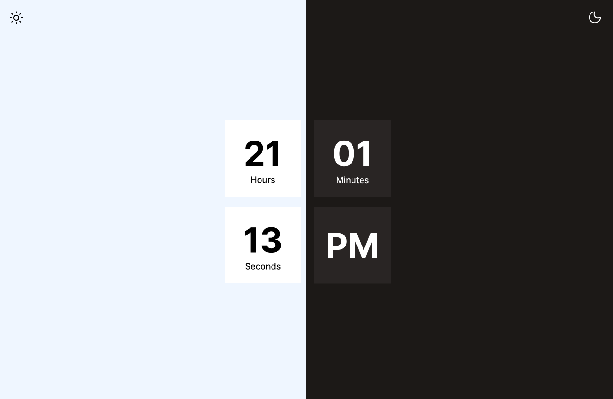

# Digial Clock
A minimalist and plain design digital clock website showing your current time and the timezone with light and dark theme.

Technology used
1. HTML
2. Tailwind (CDN)
3. Vanilla Javascript
4. Node js (NPM)